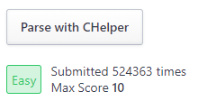

# CHelper Custom Parsers
A userscript which adds custom parsers to CHelper.

## Description
This userscript makes it possible to easily add new parsers to CHelper without modifying it's source or the extension. It works by making CHelper think it is receiving a CSAcademy task, while it is just an HTML body which is made to *look* like how CSAcademy structures their page. The downside is that it won't enable the button the CHelper extension adds to the browser, but you instead need to click on a button visible on the problem's or contest's page.

### Included parsers
- HackerRank: Adds a button to the problem sidebar and fixes the issue of HackerRank not working with CHelper anymore.  

## Installation

1. Install [Tampermonkey](https://tampermonkey.net/). This is the userscript manager this script was tested with.
2. Click on the following link to install the userscript:  
https://raw.githubusercontent.com/jmerle/chelper-custom-parsers/master/dist/chelper-custom-parsers.user.js
3. Make sure you got a CHelper project open.
4. Read the information about mixed content below to get the userscript working.

### Mixed content
Since most problem sites got https enabled, there's a little bit of a problem since CHelper expects problems to be sent to a non-https url. Most browsers automatically stop scripts from making requests to an http domain from an https one, so you'll need to override this.

#### Chrome
For Chrome there are two ways to work around this issue:
1. The more secure but also more annoying option. You'll have to repeat this process every browser session.
    1. Go to any of the supported problem sites ([example](https://www.hackerrank.com/challenges/simple-array-sum/problem)) and click the "Parse" button.
    2. Nothing happens because Chrome blocks the request, so click on the little shield icon on the right of the addressbar.
    3. In the popup that opened, click on 'Load unsafe scripts'.
    4. The page will refresh and the "Parse" button will work correctly.
2. The less secure but less annoying option. When configured properly, you only need to do this once.
    1. Run Chrome with the `--allow-running-insecure-content` option.

#### Firefox
For Firefox, there are also two ways around the issue:
1. Just like with Chrome, this is the more secure but also more annoying option. You'll have to repeat this process for every browser session and every problem site.
    1. Go to any of the supported problem sites ([example](https://www.hackerrank.com/challenges/simple-array-sum/problem)) and click the "Parse" button.
    2. Nothing happens because Firefox blocks the request, so click on the little green lock icon on the left of the addressbar.
    3. In the popup that opened, click on the arrow pointing right.
    4. Click on the button saying 'Disable protection for now'. The page will refresh and the "Parse" button will work correctly.
2. Same as with Chrome, the less secure but less annoying option. You only need to do this once.
    1. Go to `about:config`.
    2. Click on 'I accept the risk' if a warning shows up.
    3. Search for `security.mixed_content.block_active_content`.
    4. Set this setting to false by double-clicking on the row.
    5. Go back to the problem page and refresh it. The button will now correctly work.
